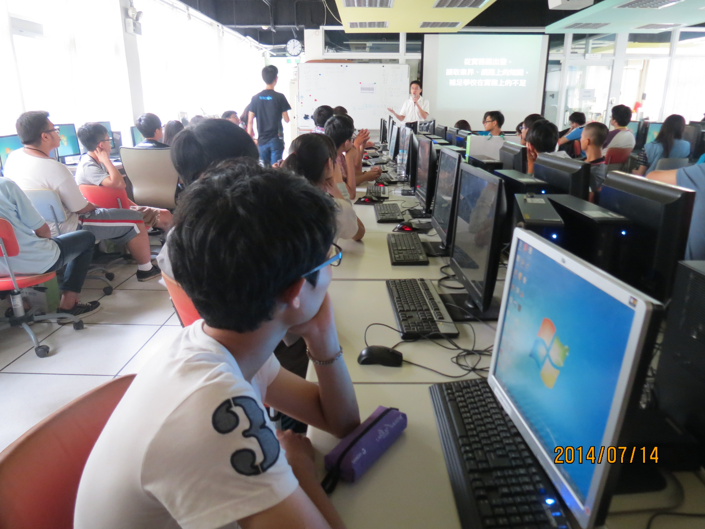
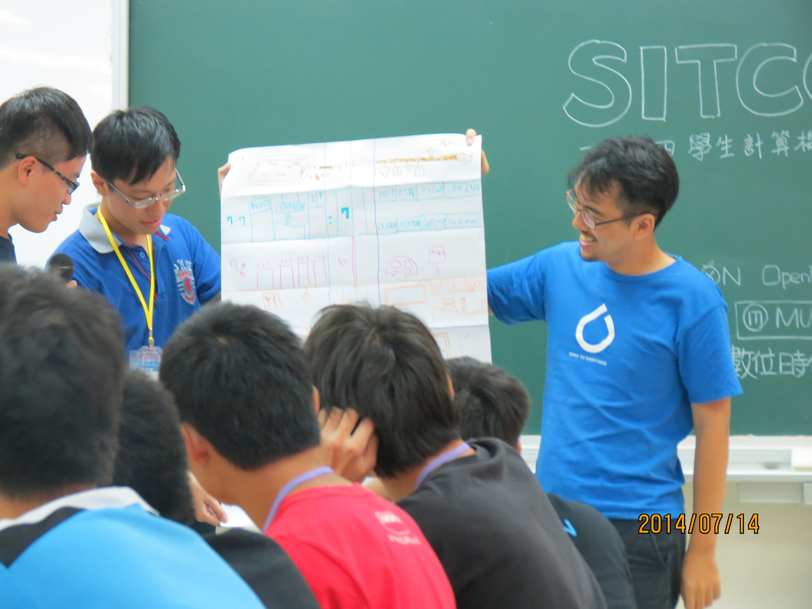

title: 感恩師父 讚嘆師父 Git 超棒 der
output: index.html

--

<h1 style="font-size: 72px">
  感恩師父 讚嘆師父<br />
  Git 超棒 der
</h1>
<br />

## Denny Huang

--

### Denny Huang
# 綠衣教主?!

--

<div align="center">
  
</div>

--

<div align="center">
  
  <a href="http://sitcon.org/">http://sitcon.org</a>
</div>

--

<br />
<br />
<div align="center">
  
</div>

--

<br />
<br />
<div align="center">
  
</div>

--

<div align="center">
  
</div>

--

<div align="center">
  
</div>

--

<div align="center">
  
</div>

--

<div align="center">
  
</div>

--

<div align="center">
  
</div>

--

<div align="center">
  
</div>

--

### 定期聚
* 台北
* 桃園
* 新竹
* 台中
* 台南

--

# SITCON 2015
## 2015 / 03 / 07 ＠  中央研究院人文社會館

--

# The True Hackers
## 學生與創新實作

--

<h1 style="font-size:72px">Call For Paper</h1>
<h2>
密切注意 SITCON <a href="https://www.facebook.com/groups/sitcon.tw/" target="_blank">FB社團</a> / <a href="https://www.facebook.com/SitconTW" target="_blank">粉絲團</a>
</h2>

--

<div align="center">
  <br />
</div>

--

### 今天要講的東西

--

### 今天要講的東西

* Git 基本概念

--

### 今天要講的東西

* Git 基本概念

* Git 如何使用?

--

### 今天要講的東西

* Git 基本概念

* ~~Git 如何使用~~

--

### 今天要講的東西

* Git 基本概念

* ~~Git 如何使用~~

* Git 的運作原理

--

<br />
<h2 style="font-size:48px">
    2014/12/07<br /><br />
  <a href="http://sitcon.kktix.cc/events/sitcon-workshop-2014-hackgen-git" target="_blank">
    HackGen 2015 Workshop<br />
    Git 版本控制入門
  </a>
</h2>

--

### Git
# 版本控制系統

--

### File system
<div align="center">
  
</div>

--

### Git
<div align="center">
  <br />
  
</div>

--

### How Git works?

`inotifywait -rm --format '%w%f %e' -e create -e close_write .`

`git init`

`echo test > file`

`git add file`

--

### 9daeafb9864cf43055ae93beb0afd6c7d144bfa4

* SHA1 of "blob 5␀test␊"

* `printf "blob 5\000test\n" | xxd`

* `printf "blob 5\000test\n" | shasum`

* `echo test | git hash-object --stdin`

* `git cat-file -p 9daeafb9864cf43055ae93beb0afd6c7d144bfa4`

--

* `cd .git/objects/9d/`

``` python
[denny@X230 9d]$ python
Python 2.7.5 (default, Nov  3 2014, 14:26:24)
[GCC 4.8.3 20140911 (Red Hat 4.8.3-7)] on linux2
Type "help", "copyright", "credits" or "license" for more information.
>>> fd = open("aeafb9864cf43055ae93beb0afd6c7d144bfa4", "rb")
>>> line = fd.read()
>>> import zlib
>>> zlib.decompress(line)
'blob 5\x00test\n'
```

--

### cat-file -p &lt;revision&gt;

`git cat-file -p 8b9af3b`


```
tree 993624220e92bb14b1703b6005dccfda913e95bc
parent a5d55500219b63ac21bb3977ae1a69bf5f1f793f
author Denny Huang <denny0223@gmail.com> 1407702807 +0800
committer Denny Huang <denny0223@gmail.com> 1407702807 +0800

update
```

--

### 總有意外

* 密碼忘記

* 無法接觸實體機器

* Code 沒留

--

# 噢！

--

# .git 可以 access

--

<div style="font-size: 40px" align="center">
  <br />
  <br />
  <br />
  <br />
  <a href="https://github.com/denny0223/scrabble">https://github.com/denny0223/scrabble</a>
</div>

--

<div style="font-size: 45px" align="center">
  <br />
  <br />
  <br />
  <code>scrabble http://example.com/</code>
</div>

--

# 用 Git 很好

--

<h1 style="font-size: 72px">
  但請務必注意<br />
  存取權限
</h1>
<br />

--

# Q & A

--

<h1 style="font-size:72px">Thanks for listening</h1>
